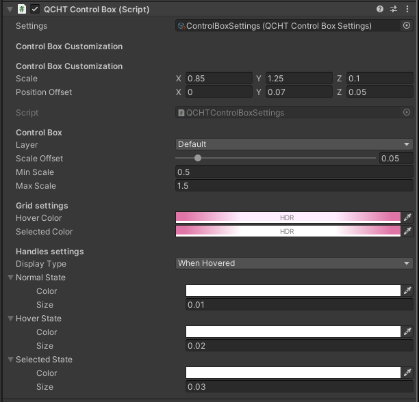

# DigiLens Inc. Instructions App

This repository contains the **Instructions App** built with Unity and designed for Snapdragon Spaces-enabled devices. This guide will help you set up the project, import required SDKs, and verify functionality including QCHT (Qualcomm Hand Tracking) interactions.

---

## Prerequisites

- [Unity Hub](https://unity.com/download)
- **Unity Editor 2022.3.45f1** ([Download from Unity Archive](https://unity.com/releases/editor/archive))
- **Snapdragon Spaces Unity SDK v1.0.0**
- DigiOS Software Build Version **B1.0001.2116**

---

## Downloading the Project

1. Open **Unity Hub**.
2. Go to the **Installs** tab.
3. If not installed, download **Unity Editor 2022.3.45f1** from the [Unity Download Archive](https://unity.com/releases/editor/archive).
4. In the Instructions App GitHub repository:
- Click the green **Code** button:
- Use **Open with GitHub Desktop**, or
  - Select **Download ZIP** and extract manually.
5. Back in Unity Hub, head to the **Projets** tab and click **Add** → **Add project from disk**, and select the cloned/extracted repository folder.

---

## Installing Snapdragon Spaces

1. Open the project in Unity Hub.
2. Ignore any compilation/plugin errors.
3. Once the project file has been opened, head to the **Package Manager** (Window → Package Manager).
4. In the **Package Manager**, click on the "+" icon in the top left, then select **Add package from tarball** from the dropdown menu.
5. Choose the **SnapdragonSpaces_Package.tgz** file from the **Snapdragon Spaces Unity SDK 1.0.0** folder.
6. After importing, you will see a pop-up message. Select **Yes** to proceed.
7. Click the **Snapdragon Spaces** package in the **Package Manager**, head to **Samples** and import **Core Samples**.
8. Head to the **Package Manager** (Window → Package Manager) again; this time, select the **QCHT Unity Interactions.tgz** file from the **Snapdragon Spaces Unity SDK** folder.
9. After importing the **QCHT Unity Interactions** package, click the package in the **Package Manager**, head to **Samples** and import **Core Assets** and **QCHT Samples**.

You’ve now installed the required packages.

---

## Verify OpenXR Settings

1. Follow the `Configuring XR Settings` instructions from [this article](https://developer.digilens.com/hc/en-us/articles/36241428293659-Developing-for-Snapdragon-Spaces-1-0-1#h_01JF93CTK84V4FPSYS8Y8QEB31) for an easier configuration process.
2. Open the OpenXR Settings (Edit → Project Settings → XR Plugin-In Management → OpenXR)
3. Ensure `Base Runtime` and `Hand Tracking` are enabled.

---

## Verifying the QCHT Control Box Script

1. In **Hierarchy**, select the `Instruction Panels` object.
2. In the **Inspector**, check for the `QCHT Control Box (Script)` component.
3. For the `Settings` field, choose `ControlBoxSettings (QCHT Control Box Settings)`
4. Edit `QCHTControlBox.cs`:
   
  - Locate the following line:

  ```csharp
  [SerializeField] private QCHTControlBoxSettings settings;
  ```

- Add the following lines directly below it:

  ```csharp
  [Header("Control Box Customization")]
  [SerializeField] private UnityEngine.Vector3 controlBoxScale = UnityEngine.Vector3.one;
  [SerializeField] private UnityEngine.Vector3 controlBoxPositionOffset = UnityEngine.Vector3.zero;
  ```

- Locate the function:

  ```csharp
  private bool TryToLoadGrid(out XRInteractionGrid grid)
  ```

- Find these lines inside the function:

  ```csharp
  var test = t.rotation * bounds.size;
  var scale = settings ? Vector3.one * settings.ScaleOffset : Vector3.one;
  gridObject.transform.localScale = Vector3Extensions.Abs(test.Divide(t.lossyScale)) + scale;
  gridObject.transform.localPosition = t.InverseTransformPoint(bounds.center);
  ```

- Replace them with:

  ```csharp
  gridObject.transform.localScale = controlBoxScale;
  gridObject.transform.localPosition = t.InverseTransformPoint(bounds.center) + controlBoxPositionOffset;
  ```

- Scroll to the bottom of the script. Before the `#if UNITY_EDITOR` section, add:

  ```csharp
  private void OnDrawGizmos()
  {
      if (!Application.isPlaying)
      {
          Gizmos.color = Color.green;
          UnityEngine.Vector3 boxCenter = transform.position + controlBoxPositionOffset;
          Gizmos.DrawWireCube(boxCenter, controlBoxScale);
      }
  }
  ```

- Below `private SerializedProperty _settingsProperty;` add:

  ```csharp
  private SerializedProperty _scaleProperty;
  private SerializedProperty _positionOffsetProperty;
  ```

- Locate this part in the script:

  ```csharp
  public void OnEnable()
  {
      _settingsProperty = serializedObject.FindProperty("settings");
  }
  ```

- Replace it with:

  ```csharp
  public void OnEnable()
  {
      _settingsProperty = serializedObject.FindProperty("settings");
      _scaleProperty = serializedObject.FindProperty("controlBoxScale");
      _positionOffsetProperty = serializedObject.FindProperty("controlBoxPositionOffset");
  }
  ```

- Locate the function:

  ```csharp
  public override void OnInspectorGUI()
  ```

- Inside the function, locate this line:

  ```csharp
  GUILayout.Space(10);
  ```

- Directly below that line, insert the following:

  ```csharp
  EditorGUILayout.LabelField("Control Box Customization", EditorStyles.boldLabel);
  EditorGUILayout.PropertyField(_scaleProperty, new GUIContent("Scale"));
  EditorGUILayout.PropertyField(_positionOffsetProperty, new GUIContent("Position Offset"));
  ```    
5. Save the script and return to Unity.
6. Select `Instruction Panels` and confirm the fields are visible and adjust the values accordingly:



---

## Adding Your Own Instructions

1. Select the `StepController` object in the Hierarchy.
2. If you use videos, add your `.mp4` videos to the `Assets/Video Clips/` folder.
3. In the **Step Manager** component:
   - Use `+` / `-` buttons to manage steps.
   - Replace placeholder content with your titles, descriptions, and video clips.

---

## Building & Installing the APK

1. Go to **File → Build Settings**.
2. Ensure **Android** is selected.
3. Click **Build** to generate the APK.
4. Install the application on your device and run it. You can install the apk using adb (Android Debug Bridge), also known as Android Tools, using this command:
  ```bash
  adb install test.apk
  ```
  Alternatively, you can connect your device using Vysor, and drag & drop the installation file into the Vysor window while mirroring.
  
5. After installing the application, run it. You should now see the panels and be able to interact with them using hand tracking.

---

## Interactions within the Instructions App

There are two interaction modes for the panel:

**Unpinned Mode:** Allows the user to manually reposition, rotate, and resize the panel using Qualcomm Hand Tracking.

**Pinned Mode:** Allows the user to lock the instruction panel in place, only allowing button interactions using Qualcomm Hand Tracking. Repositioning, rotating, and resizing are not possible in this mode.

The current interaction method only uses hand tracking integration:
The panel is manipulatable via Qualcomm Hand Tracking when in unpinned mode.
The QCHT Control Box component is automatically enabled/disabled based on current mode.

**Reset Functionality:**
The Reset Button only appears in the Unpinned Mode. It resets the instruction panel to a position directly in front of the user, based on a configurable distance and height. It automatically rotates the panel to face the user upon reset.

**Button Interactions:**
The Back Button and Next Button both allow the user to go through different steps in the instruction panel. The Back Button will be hidden on the first step. The Next Button will be hidden on the last step.
In the Unpinned Mode you can see the Reset Button, which will reposition the panel on interaction.
The Mode Button allows you to switch between the Unpinned Mode and Pinned Mode.
